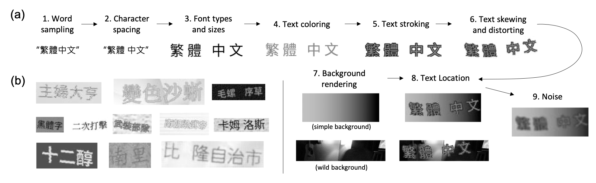
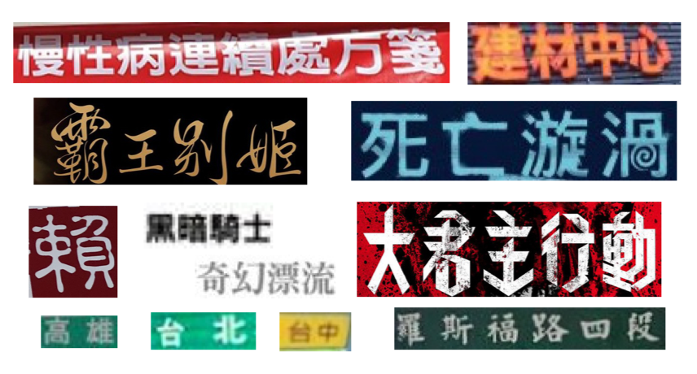

# Traditional Chinese Text Recognition Dataset: Synthetic Dataset and Labeled Data

Authors: [Yi-Chang Chen](https://github.com/GitYCC), Yu-Chuan Chang, Yen-Cheng Chang and Yi-Ren Yeh

Paper: 

Scene text recognition (STR) has been widely studied in academia and industry. Training a text recognition model often requires a large amount of labeled data, but data labeling can be difficult, expensive, or time-consuming, especially for Traditional Chinese text recognition. To the best of our knowledge, public datasets for Traditional Chinese text recognition are lacking. 

We generated over 20 million synthetic data and collected over 7,000 manually labeled data *TC-STR 7k-word* as the benchmark. Experimental results show that a text recognition model can achieve much better accuracy either by training from scratch with our generated synthetic data or by further fine-tuning with *TC-STR 7k-word*.

## Synthetic Dataset: TCSynth

Inspired by *MJSynth*, *SynthText* and [Belval/TextRecognitionDataGenerator](https://github.com/Belval/TextRecognitionDataGenerator), we propose a framework for generating scene text images for Traditional Chinese. To produce synthetic text images similar to real-world ones, we use different kinds of mechanisms for rendering, including word sampling, character spacing, font types/sizes, text coloring, text stroking, text skewing/distorting, background rendering, text Location and noise.



***TCSynth* dataset includes 21,535,590 synthetic text images.**

- Download: 
    - [TCSynth LMDB Version (Recommanded)](https://storage.googleapis.com/esun-ai/TCSynth.tar.gz) [21 GB (54 GB after untaring)]
    - [TCSynth Raw Version]() [18 GB (85 GB after untaring)]

***TCSynth-VAL* dataset includes 6,000 synthetic text images for validation.**

- Download: 
    - [TCSynth-VAL LMDB Version (Recommanded)](https://storage.googleapis.com/esun-ai/TCSynth-VAL.tar.gz)
    - [TCSynth-VAL Raw Version](https://storage.googleapis.com/esun-ai/TCSynth-VAL_raw.tar.gz)

### LMDB Version

After untaring,

```
TCSynth/
├── data.mdb
└── lock.mdb
```

Our data structure of LMDB follows the repo. [clovaai/deep-text-recognition-benchmark](https://github.com/clovaai/deep-text-recognition-benchmark). The value queried by key `'num-samples'.encode()` gets total number of text images. The index of text images starts from 1. Given the `index`, we can query binary of the image and its label by key `'image-%09d'.encode() % index` and `'label-%09d'.encode() % index`. The implement details are shown in the class [`LmdbConnector`](https://github.com/GitYCC/traditional-chinese-text-recogn-dataset/blob/main/lmdb_tools/lmdb_connector.py#L7) in [`lmdb_tools/lmdb_connector.py`](./lmdb_tools/lmdb_connector.py).

We also provide several tools to manipulate the LMDB shown in [`lmdb_tools`](./lmdb_tools). Before using those tools, we should install some dependencies. (tested with python 3.6)

```
pip install -r lmdb_tools/requirements.txt
```

- Insert images into LMDB

```
python lmdb_tools/prepare_lmdb.py \
  --input_dir IMG_FOLDER \
  --gt_file GT \
  --output_dir LMDB_FOLDER
```

- Insert images into LMDB (asynchronous version)

```
python lmdb_tools/prepare_lmdb_async.py \
  --input_dir IMG_FOLDER \
  --gt_file GT \
  --output_dir LMDB_FOLDER \
  --workers WORKERS
```

- Extract images from LMDB (asynchronous version) **(convert LMDB Version to Raw Version)**

```
python lmdb_tools/extract_to_files.py \
  --input_lmdb LMDB_FOLDER \
  --output_dir IMG_FOLDER \
  --workers WORKERS
```

### Raw Version

After untaring,

```
TCSynth_raw/
├── labels.txt
├── 0000/
│   ├── 00000001.jpg
│   ├── 00000002.jpg
│   ├── 00000003.jpg
│   └── ...
├── 0001/
├── 0002/
└── ...
```

format of labels.txt: `{imagepath}\t{label}\n`, for example:

```
0000/00000001.jpg 㒓
...
```

## Labeled Data: TC-STR 7k-word

Our *TC-STR 7k-word* dataset collects about 1,554 images from Google image search to produce 7,543 cropped text images. To increase the diversity in our collected scene text images, we search for images under different scenarios and query keywords. Since the collected scene text images are to be used in evaluating text recognition performance, we manually crop text from the collected images and assign a label to each cropped text box. 



***TC-STR 7k-word* dataset includes a training set of 3,837 text images and a testing set of 3,706 images.**

- Download: [TC-STR.tar.gz](https://storage.googleapis.com/esun-ai/TC-STR.tar.gz)

After untaring,

```
TC-STR/
├── train_labels.txt
├── test_labels.txt
└── images/
    ├── xxx_1.jpg
    ├── xxx_2.jpg
    ├── xxx_3.jpg
    └── ...
```

format of xxx_labels.txt: `{imagepath}\t{label}\n`, for example:

```
images/billboard_00000_010_雜貨鋪.jpg 雜貨鋪
images/sign_02616_999_民生路.png 民生路
...
```

## Citation

Please consider citing this work in your publications if it helps your research.
```
```
